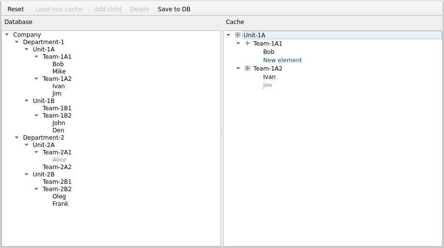

# TreeCacheDemo

A demo project of a change-tracking cache over a lazily-loaded tree.

## User interface (UI)

The Database pane (left) shows the persisted tree; the Cache pane (right) shows what's loaded and tracked locally.



**Icons in the Cache pane:**

* no icon – no children (e.g. "Bob" and "New element")
* gray plus () – has children in the database that aren't loaded yet (e.g. "Team-1A1")
* plus on gray square () – all children are loaded from the database (e.g. "Unit-1A" and "Team-1A2")

**Text styling in the Cache pane:**

* blue – added to the cache, not saved yet (e.g. "New element")
* gray strikethrough – marked as deleted in the cache, not saved yet (e.g. "Jim")

**Text styling in the Database pane:**

* gray strikethrough – marked as deleted in the database (e.g. "Alice")

Deleted elements are shown in the Database pane by default. To hide them, set `kShowDeletedElementsInDbTree` to `false` in `src/ui/MainWindow.cpp` and rebuild.

## Toolbar

The toolbar has the following commands:

* **Reset** – discards all changes and reloads the database and cache to their initial state
* **Load into cache** – loads the selected database element into the cache
* **Add child** – adds a new child under the selected cache element
* **Delete** – deletes the selected cache element and its subtree
* **Save to DB** – commits all pending cache changes to the database

`Add child` and `Delete` are enabled only when a cache element is selected.
`Save to DB` is enabled only when there are pending changes.

## Requirements

* CMake
* C++20 compiler
* Qt 5.15 (Widgets)

## Build

To build the project, go to the root of the repository (`TreeCacheDemo`) and run the following commands:

```
cmake -B build
cmake --build build
```

To run the app, execute the following command:

```
./build/TreeCacheDemo
```
